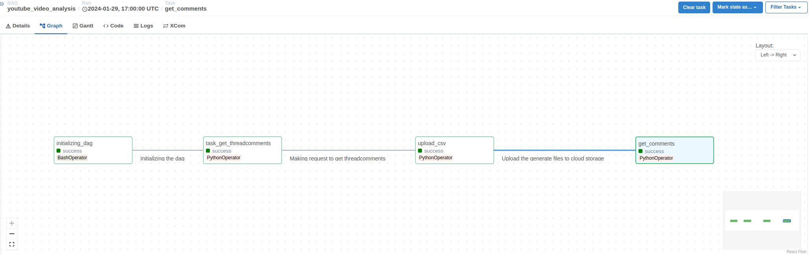
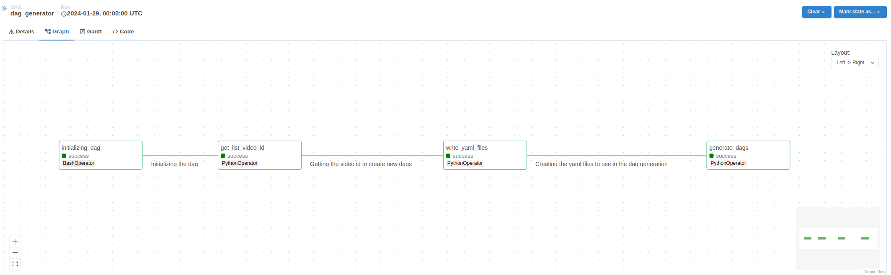
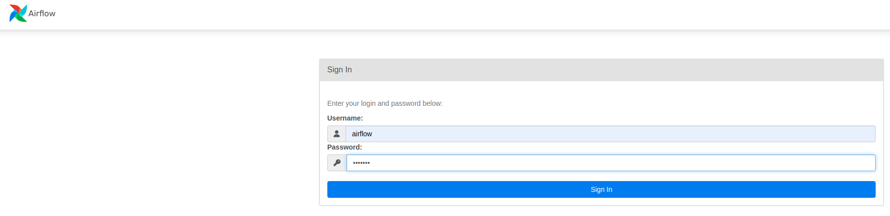
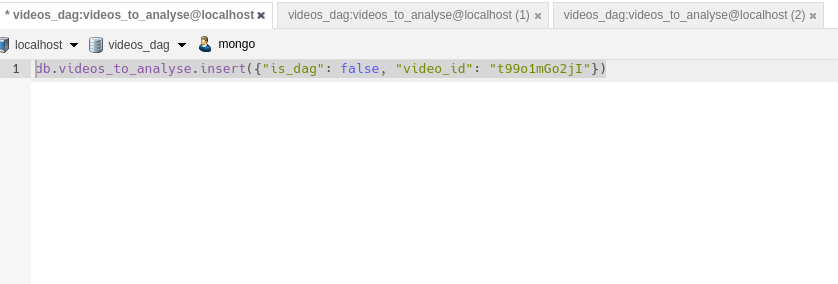
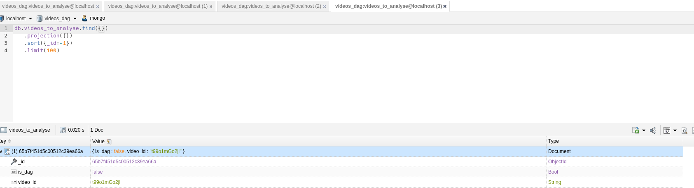

# Youtube Comments Download
* __Construção de um ETL__
    - obtem os dados através de requisição GET da api do youtube;
    - Exporta os dados como um csv;
    - Envia estes dados ao Google Cloud Storage;
    - Popula um banco de dados postgres com os dados oriundos do Storage.

---------------------
## Objetivo
Este projeto possui a finalidade de estudo, explorando as funcionalidades do airflow, do pydantic e da lib google-api-python-client.

## Introdução
O projeto é um servidor do airflow, que possui 2 dags:
- __Dag Principal__:
    - Representa um ETL, onde suas tasks se baseiam em realizar um get à api, coletar todos comentários e demais itens de interesse, exportá-los como um arquivo csv, armazenar este arquivo no Storage, e finalmente tratar estes dados e enviá-los a um banco de dados postgres, para que algumas análises possam ser feitas aos comentários e demais itens.
    - .

- __Dag Geradora de Dags__:
    - Como a dag foi desenvolvida para tratar os comentários de um vídeo, então é necessário que para cada vídeo em que se deseja analisar os comentários, seja criado uma dag. Desta forma, foi criada a dag dag_generator, que faz uma consulta ao banco de dados local mongodb, onde é obtido o video_id. Uma vez coletado este vídeo id, é gerado um arquivo yaml, que será usado junto ao template jinja2, para se criar a dag.
    - Importante notar que todas as dags geradas terão as mesmas tasks, a única diferença é somente o video_id, que vai implicar em uma diferente localização no data lake, evitando sobrescrever os arquivos.
    - .

## Como Rodar
### 1. Clone do repositório:
- git clone https://github.com/DadosComCafe/youtube_comments_download

### 2. Crie o arquivo .env, e os jsons:
- Crie o seu arquivo .env seguindo o exemplo do .env_sample. Este valor é necessário para inicializar o airflow;
- Crie um arquivo mongo_credentials.json, youtube_credentials.json, cloud_credentials.json, seguindo seus respectivos exemplos.

### 3. Build da imagem:
- Uma vez no diretório raiz do projeto, rodar:
    - docker compose up --build

### 4. Login no servidor levantado:
- Ao fim do processo de build, o seguinte endereço aparecerá informando que o sistema está escutando a partir dele:
    - http://0.0.0.0:8080
- Então, basta acessá-lo e entrar com as credenciais: username: airflow, password: airflow.
- .

### 5. Inserir os video_id's no mongo para poder gerar dinamicamente as dags:
- O script python vai procurar por registros em videos_dag.videos_to_analyse, portanto, se for utilizar esta dag é necessário
- .
- .

### 6. Ativar as dags e acompanhar o preenchimento do Storage

## Em construção:
- Este projeto ainda precisa ser finalizado, faltam alguns poucos itens a ser finalizados. São eles a correta criação de modelos pydantic para serem utilizados no processo de transformação de csv para sql, e a inserção dos valores no postgres.

## Muito obrigado por acompanhar o projeto !!
